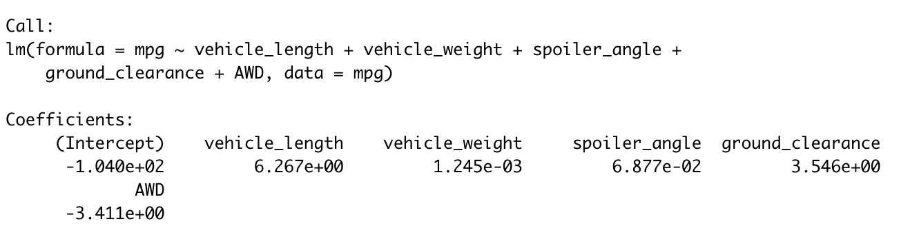
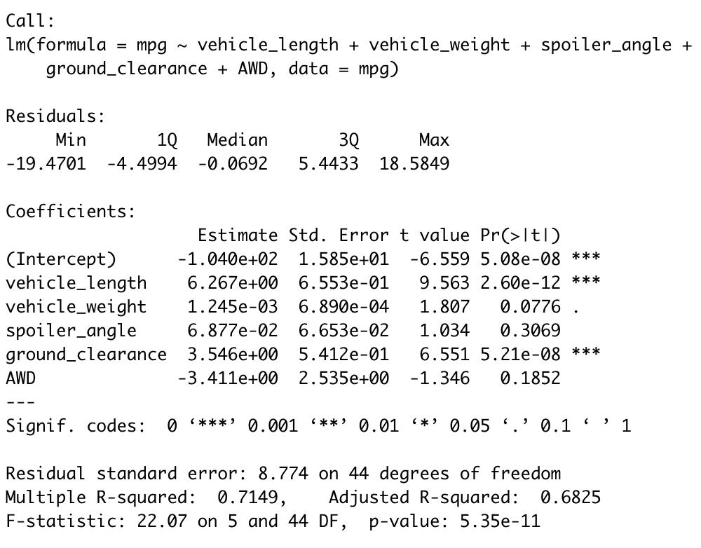

# MechaCar Statistical Analysis

## Linear Regression to Predict MPG
Using the MechaCar dataset containing mpg test results for 50 prototype MechaCars, I designed a linear model to predict the mpg in the prototypes using several variables from the dataset. 

|*Multiple Linear Regression Statement*|
|:--:|
||

The output of the lm() function produces the coefficients for each variable in the linear equations, giving us the following multiple linear regression model:

> mpg = 6.267(vehicle_length) + 0.001(vehicle_weight) + 0.069(spoiler_angle) + 3.546(ground_clearance) - 3.411(AWD) - 104

|*Statistical Metrics*|
|:--:|
||

Due to their p-values, vehicle length and ground clearance are statistically unlikely to provide random amounts of variance to the linear model, meaning they have a significant impact on mpg.

The model's p-value of 5.35e-11 is smaller than the assumed significance level of 0.05%, which indicates there is sufficienct evidence to reject the null hypothesis indicating that the slope of this linear model is not zero.

The model's R-squared calue is 0.7149 which gives a strong correlation which indicates this linear model does effectively predict mpg of MechaCar prototypes.

