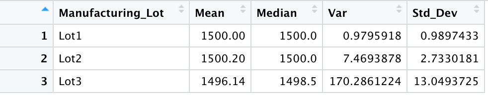
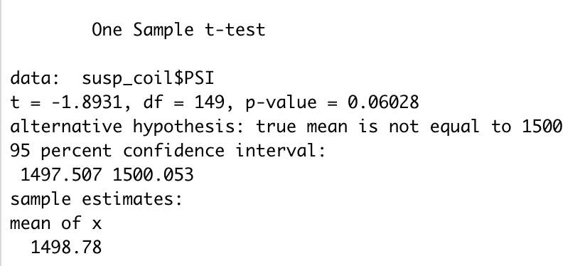
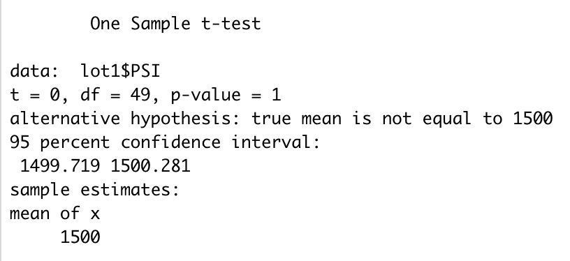
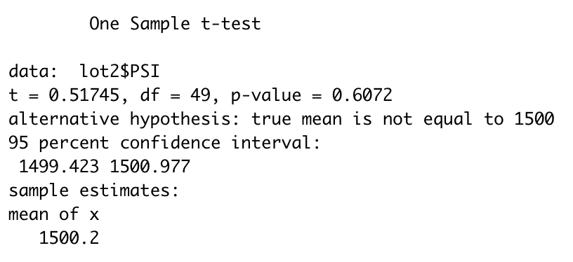
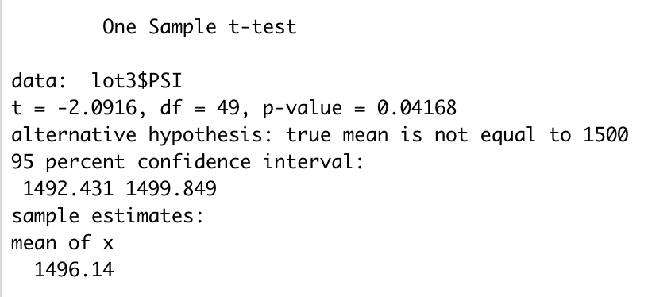

# MechaCar Statistical Analysis

## Linear Regression to Predict MPG
The MechaCar_mpg.csv dataset contains mpg test results for 50 prototype MechaCars. The MechaCar prototypes were produced using multiple design specifications to identify ideal vehicle performance. Multiple metrics, such as vehicle length, vehicle weight, spoiler angle, drivetrain, and ground clearance, were collected for each vehicle. Using my knowledge of R, I designed a linear model that predicts the mpg of MechaCar prototypes using several variables from the MechaCar_mpg.csv file.  

|*Multiple Linear Regression Statement*|
|:--:|
||

The output of the lm() function produces the coefficients for each variable in the linear equations, giving us the following multiple linear regression model:

> mpg = 6.267(vehicle_length) + 0.001(vehicle_weight) + 0.069(spoiler_angle) + 3.546(ground_clearance) - 3.411(AWD) - 104

|*Statistical Metrics*|
|:--:|
||

Due to their p-values, vehicle length and ground clearance are statistically unlikely to provide random amounts of variance to the linear model, meaning they have a significant impact on mpg.

The model's p-value of 5.35e-11 is smaller than the assumed significance level of 0.05%, which indicates there is sufficienct evidence to reject the null hypothesis indicating that the slope of this linear model is not zero.

The model's R-squared calue is 0.7149 which gives a strong correlation which indicates this linear model does effectively predict mpg of MechaCar prototypes.

## Summary Statistics on Suspension Coils

The MechaCar Suspension_Coil.csv dataset contains the results from multiple production lots. In this dataset, the weight capacities of multiple suspension coils were tested to determine if the manufacturing process is consistent across production lots. Using my knowledge of R, I created a summary statistics table to show the suspension coil’s PSI continuous variable across all manufacturing lots and the following PSI metrics for each lot: mean, median, variance, and standard deviation.

|*Total Summary*|
|:--:|
||

|*Lot Summary*|
|:--:|
||

The design specifications for the MechaCar suspension coils dictate that the variance of the suspension coils must not exceed 100 pounds per square inch. The current manufacturing data meets this specification for the total since the overall variance was 62.30 PSI. Lot 1 and Lot 2 also met the specification with 0.98 PSI and 7.47 PSI respectively. However, Lot 3 does not meet the specification because it had a variance of 170.29 PSI.

## T-Tests on Suspension Coils
Using my knowledge of R, I performed t-tests to determine if all manufacturing lots and each lot individually are statistically different from the population mean of 1,500 pounds per square inch.

|*All Manufacturing Lot T-Test*|
|:--:|
||

In the full manufacturing lot, the true mean of the sample is 1498.78 with a p-value of 0.06028. Since the p-value is greater than the common signicance level of 0.05, there is not enough evidence to support rejecting the null hypothesis. Therefore, the full manufacturing lot is statistically similar to the presumed population mean of 1,500.

|*Lot 1 T-Test*|
|:--:|
||

In Lot 1, the true mean of the sample is 1500 with a p-value of 1. Since the p-value is greater than the common signicance level of 0.05, there is not enough evidence to support rejecting the null hypothesis. Therefore, the full manufacturing lot is statistically similar to the presumed population mean of 1,500.

|*Lot 2 T-Test*|
|:--:|
||

In Lot 2, the true mean of the sample is 1500.2 with a p-value of 0.6072. Since the p-value is greater than the common signicance level of 0.05, there is not enough evidence to support rejecting the null hypothesis. Therefore, the full manufacturing lot is statistically similar to the presumed population mean of 1,500.

|*Lot 3 T-Test*|
|:--:|
||

In Lot 3, the true mean of the sample is 1496.14 with a p-value of 0.04168. Since the p-value is less than the common signicance level of 0.05, there is enough evidence to support rejecting the null hypothesis. Therefore, the full manufacturing lot is not statistically similar to the presumed population mean of 1,500.